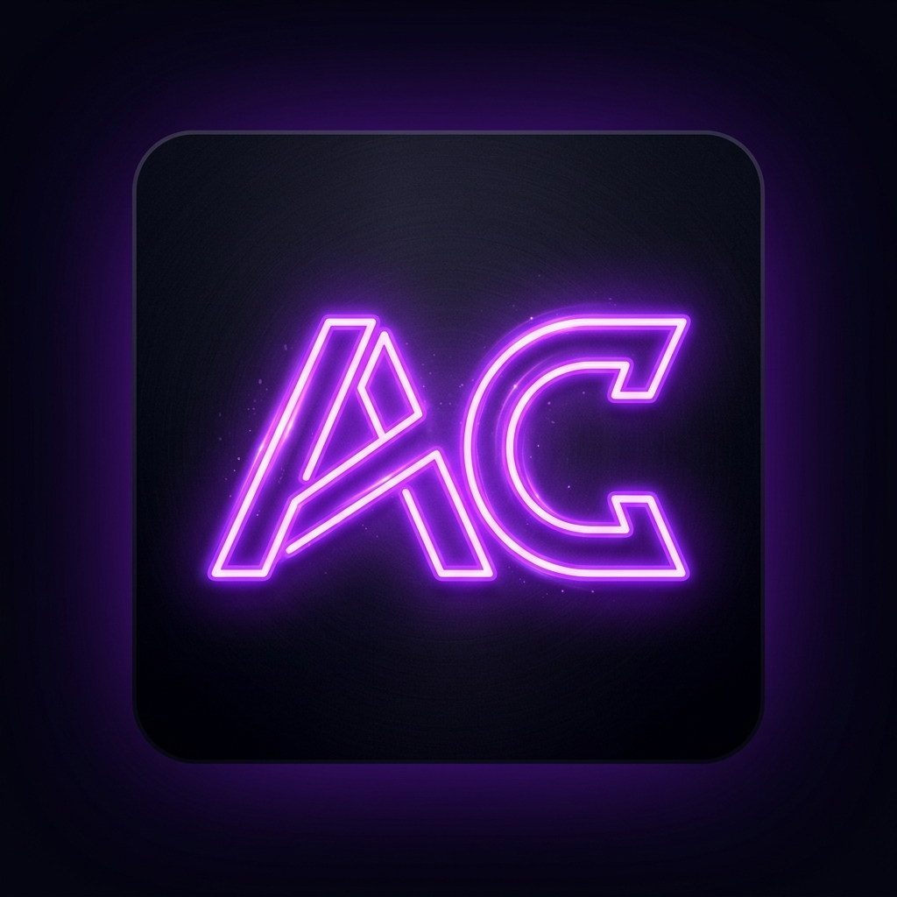
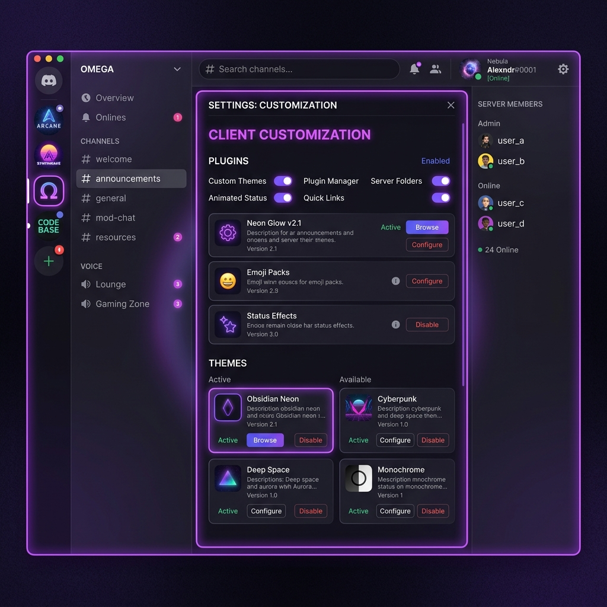

<p align="center">
  
</p>

<h1 align="center">🔮 ArgusCord</h1>

<p align="center">
  <strong>A premium, lightweight, next-generation client modification for Discord designed for peak performance, ultimate customization, and total privacy.</strong>
</p>

<p align="center">
  
  
  
  
</p>

---

## ✨ Features

* **🎨 Custom Default Theme:** Preloaded with a premium neon-violet glow, dark midnight-purple background, customized scrollbars, and vibrant active states.
* **🔌 100+ Built-in Plugins:** Instantly toggle premium options directly from your settings tab (Spotify controls, local Nitro benefits, blocked trackers, volume boosters, and much more).
* **🛡️ Privacy-First:** Completely blocks all internal Discord telemetry, trackers, and crash reporting out of the box.
* **🖥️ Standalone GUI Installer:** A beautiful self-contained Windows C# WPF app that automatically detects, patches, and manages your Discord installation completely offline.
* **🌐 Bilingual Landing Page:** A gorgeous static website supporting English and Arabic, featuring RTL layout toggle and a step-by-step setup guide.

---

## 📁 Repository Structure

```text
├── assets/             # Branding logos and preview screenshots
├── ArgusCord/          # Client-side modification source code (TypeScript)
├── ArgusCordInstaller/ # Native Windows C# WPF GUI Installer project
└── website/            # Bilingual Arabic & English static landing page website
```

---

## 📸 Client Preview

<p align="center">
  
</p>

---

## 🚀 Getting Started

### 1. Launching the GUI Installer
To patch and run ArgusCord on your local Discord installation:
* Open the workspace and launch `ArgusCordInstaller.exe` (or build it from `ArgusCordInstaller/`).
* Choose your Discord branch (Stable, PTB, Canary) and click **Install**.
* The installer will automatically inject the client code into your Discord directory.

### 2. Website Setup (Local Test)
To run the bilingual landing page locally:
1. Navigate to the `website/` directory.
2. Run a simple static web server:
   ```bash
   npx http-server -p 8000
   ```
3. Open `http://127.0.0.1:8000` in your browser.

### 3. Client Development
To modify or add plugins to the client:
1. Go to the `ArgusCord/` folder.
2. Install dependencies:
   ```bash
   pnpm install
   ```
3. Run compiler in development mode:
   ```bash
   pnpm dev
   ```

---

## 📜 License

ArgusCord is open-source software licensed under the **GPL-3.0 License**. Feel free to customize and expand it!
